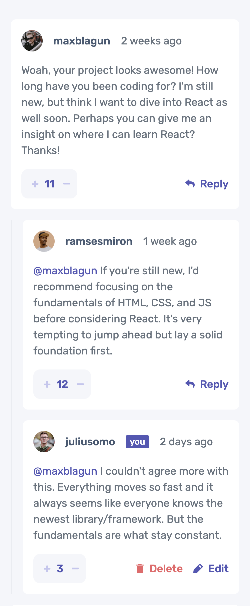
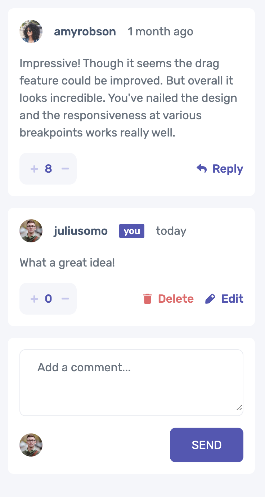
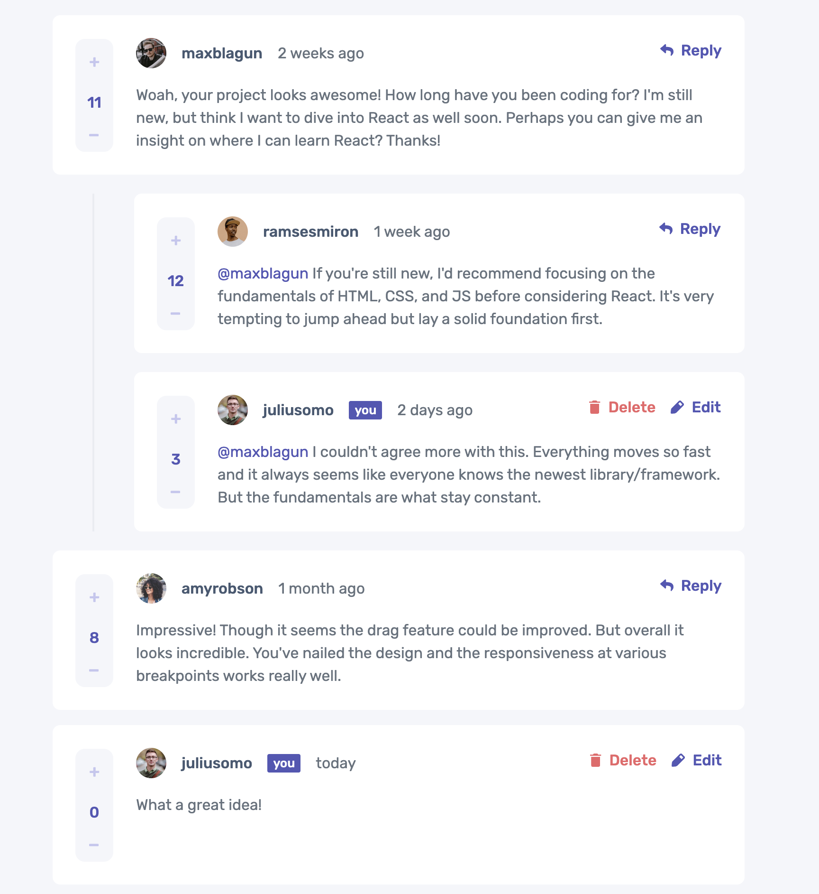
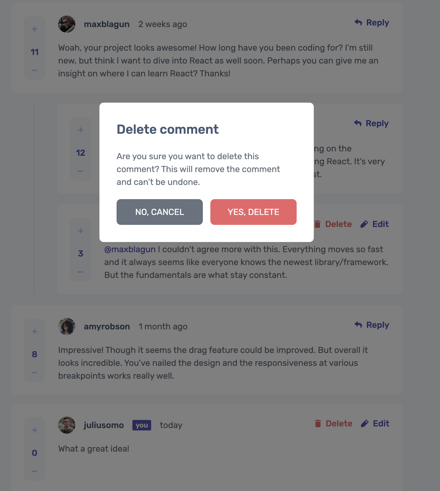

# Frontend Mentor - Interactive comments section solution

This is my solution to the [Interactive comments section challenge on Frontend Mentor](https://www.frontendmentor.io/challenges/interactive-comments-section-iG1RugEG9). Frontend Mentor challenges help you improve your coding skills by building realistic projects. 

## Table of contents

- [Overview](#overview)
  - [The challenge](#the-challenge)
  - [Screenshot](#screenshot)
  - [Links](#links)
- [My process](#my-process)
  - [Built with](#built-with)
  - [What I learned](#what-i-learned)
- [Author](#author)

## Overview

### The challenge

Users should be able to:

- View the optimal layout for the app depending on their device's screen size
- See hover states for all interactive elements on the page
- Create, Read, Update, and Delete comments and replies
- Upvote and downvote comments
- **Bonus**: If you're building a purely front-end project, use `localStorage` to save the current state in the browser that persists when the browser is refreshed.
- **Bonus**: Instead of using the `createdAt` strings from the `data.json` file, try using timestamps and dynamically track the time since the comment or reply was posted.

### Screenshot

#### Mobile 

#### Full

### Links

- Solution URL: [solution URL](https://github.com/roodhouse/frontend-mentor-comments)
- Live Site URL: [live site](https://comments.rugh.us)

## My process

### Built with

- HTML5, CSS
- Mobile-first workflow
- React
- Tailwind

### What I learned

This project was probably the most challenging one to date on this site. I grew a lot in my understanding of javascript and was able to practice with some tools. Mainly localstorage, findIndexOf etc. I found myself having to refactor the code several times. The look was correct, but the logic forced me to change the look, then the logic was incorrect after adjusting the look. My mistake was making a gameplan solely based on the mobile design. Instead I need to make a plan with the entire design in mind so I can account for those changes that occur at larger widths. I did not complete all of the active state pieces for this reason.

## Author

- Website - [my site](https://rugh.us)
- Frontend Mentor - [@roodhouse](https://www.frontendmentor.io/profile/roodhouse)
- LinkedIn - [John Rugh](https://www.linkedin.com/in/john-m-rugh/)